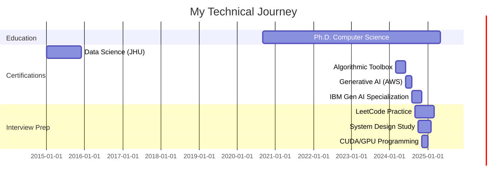

# Hi there, I'm Mohammad Pivezhandi 👋

<div align="center">

[](https://pivezhan.github.io)
[](https://scholar.google.com/citations?user=uv7HouQAAAAJ&hl=en)
[](https://www.linkedin.com/in/mpivezhandi/)
[](https://pivezhan.github.io/cv)

**Ph.D. Candidate in Computer Science | Wayne State University**

*AI-guided energy-, thermal-, and performance-aware scheduling for heterogeneous multicore and embedded systems*

</div>

---

## 🎯 About Me

I'm a **Ph.D. candidate in Computer Science** at Wayne State University, specializing in:

- 🧠 **AI-Driven System Optimization**: Energy-, thermal-, and performance-aware scheduling
- 🖥️ **Heterogeneous Computing**: ARM, x86, Jetson platforms
- 🚀 **Embedded Systems**: Real-time scheduling and resource management
- 🤖 **Machine Learning & LLMs**: Generative AI, RAG systems, fine-tuning
- 💻 **GPU Programming**: CUDA optimization and parallel computing

Currently preparing for **system engineering**, **ML engineering**, **GPU engineering**, and **solutions architect** roles at leading tech companies.

---

## 📊 GitHub Stats

<div align="center">


</div>

---

## 🗂️ Repository Portfolio

### 🎓 Major Learning Repositories

<table>
<tr>
<td width="50%">

#### 🤖 [Generative AI & LLMs](https://github.com/pivezhan/Generative-AI)
[](https://www.python.org/)
[](https://pytorch.org/)
[](https://www.langchain.com/)

**Comprehensive Gen AI Journey**
- ✅ 3 Major Certifications (AWS, IBM, DeepLearning.AI)
- ✅ 16-Course IBM Specialization
- ✅ LangChain Mastery & RAG Systems
- ✅ Fine-tuning, PEFT, LoRA, RLHF
- ✅ Production-ready implementations

**Key Projects:**
- 📝 Dialogue Summarization (FLAN-T5)
- 🔧 Model Fine-tuning Pipeline (AWS SageMaker)
- ✨ RLHF Detoxification Model
- 🤖 RAG-Powered QA System
- 🎙️ Voice Assistant with Whisper
- 🌐 Universal Language Translator

[**→ Explore Repository**](https://github.com/pivezhan/Generative-AI)

</td>
<td width="50%">

#### 🎯 [Interview Preparation](https://github.com/pivezhan/interview_prep)
[](https://www.python.org/)
[](https://isocpp.org/)
[](https://developer.nvidia.com/cuda-zone)

**Structured Technical Interview Prep**
- ✅ 150+ LeetCode Problems
- ✅ GPU/CUDA Programming
- ✅ System Design Patterns
- ✅ ML/DL Implementations
- ✅ 4 Industry Certifications

**Coverage:**
- 📊 Data Structures & Algorithms
- 🚀 CUDA & GPU Optimization
- 🐍 Python Standard Library
- 🤖 PyTorch & NumPy
- 💻 C++ & STL

[**→ Explore Repository**](https://github.com/pivezhan/interview_prep)

</td>
</tr>
<tr>
<td width="50%">

#### 📈 [Data Science Specialization](https://github.com/pivezhan/Data-Science-Specialization)
[](https://www.r-project.org/)
[](https://www.coursera.org/)

**Johns Hopkins University Program**
- ✅ 9-Course Specialization Complete
- ✅ 6 Certificates Earned
- ✅ R Programming Mastery
- ✅ Statistical Inference
- ✅ Machine Learning with Caret

**Courses Completed:**
1. Data Scientist's Toolbox
2. R Programming
3. Getting & Cleaning Data
4. Exploratory Data Analysis
5. Reproducible Research
6. Statistical Inference
7. Regression Models
8. Practical Machine Learning
9. Developing Data Products

[**→ Explore Repository**](https://github.com/pivezhan/Data-Science-Specialization)

</td>
<td width="50%">

#### 🌐 [Personal Website](https://pivezhan.github.io)
[](https://pivezhan.github.io)

**Professional Portfolio & Research**
- 📄 Publications & Research Papers
- 🎓 Teaching Experience
- 🏆 Projects & Achievements
- 🎨 Hobbies & Interests

**Sections:**
- [Projects](https://pivezhan.github.io/projects)
- [Publications](https://pivezhan.github.io/publications)
- [Teaching](https://pivezhan.github.io/teaching)
- [Hobbies](https://pivezhan.github.io/hobbies)

[**→ Visit Website**](https://pivezhan.github.io)

</td>
</tr>
</table>

---

## 🏆 Certifications & Achievements

<details>
<summary><b>📜 Click to view all 20+ certifications</b></summary>

### 🎓 Software Engineering & Interview Prep

| Certificate | Institution | Year | Link |
|------------|-------------|------|------|
| 🥇 **Introduction to Software Engineering** | IBM | 2024 | [Verify](https://www.coursera.org/account/accomplishments/verify/K1I40TWU2DNY) |
| 🥇 **Algorithmic Toolbox** | UC San Diego | 2024 | [Verify](https://www.coursera.org/account/accomplishments/verify/TJGVPNFW5UXD) |
| 🥇 **Java Programming: Solving Problems** | Duke University | 2024 | [Verify](https://www.coursera.org/account/accomplishments/verify/BPQ4YL8O1GYQ) |
| 🥇 **Coding Interview Preparation** | Meta | 2024 | [Verify](https://www.coursera.org/account/accomplishments/verify/F51ETMLK47JF) |
| 🥇 **Software Developer Career Guide** | IBM | 2024 | [Verify](https://www.coursera.org/account/accomplishments/verify/E9JBR4SQ25LU) |

### 🤖 Generative AI & Large Language Models

| Certificate | Institution | Year | Link |
|------------|-------------|------|------|
| 🏆 **Generative AI with Large Language Models** | AWS + DeepLearning.AI | 2024 | [Verify](https://www.coursera.org/account/accomplishments/verify/Q45TTU6I0D40) |
| 🏆 **LangChain for LLM Application Development** | DeepLearning.AI | 2024 | [Course](https://www.deeplearning.ai/short-courses/langchain-for-llm-application-development/) |
| 🏆 **Generative AI: Elevate Software Development** | IBM | 2024 | [Verify](https://www.coursera.org/account/accomplishments/verify/CG14ZL77BFE8) |

### 🌐 Cloud & Python

| Certificate | Institution | Year | Link |
|------------|-------------|------|------|
| ☁️ **Introduction to Cloud Computing** | IBM | 2024 | [Verify](https://www.coursera.org/account/accomplishments/verify/6CNW6N8QRQ9M) |
| 🐍 **Python for Data Science, AI & Development** | IBM | 2024 | [Course](https://www.coursera.org/learn/python-for-applied-data-science-ai) |

### 📊 Data Science Specialization (Johns Hopkins University)

| Certificate | Score | Year | Link |
|------------|-------|------|------|
| 📈 **The Data Scientist's Toolbox** | 99.3% | 2015 | [View PDF](https://www.dropbox.com/s/i022oltltqriq1u/datascitoolbox2015.pdf) |
| 💻 **R Programming** | 100.0% | 2015 | [View PDF](https://www.dropbox.com/s/41jvp14zla73dpl/rprog2015.pdf) |
| 🧹 **Getting and Cleaning Data** | 98.0% | 2015 | [View PDF](https://www.dropbox.com/s/1qzrrhnjf1i3now/getdata2015.pdf) |
| 📊 **Statistical Inference** | 100.0% | 2015 | [View PDF](https://www.dropbox.com/s/yj3l3cedgvc2aee/statinference2015.pdf) |
| 📝 **Reproducible Research** | 97.1% | 2015 | [View PDF](https://www.dropbox.com/s/gu82lzy3t8cu2vt/repdata2015.pdf) |
| 📉 **Regression Models** | 91.7% | 2015 | - |
| 🔍 **Exploratory Data Analysis** | 96.7% | 2015 | - |
| 🤖 **Practical Machine Learning** | 100.0% | 2015 | [View PDF](https://www.dropbox.com/s/your-link/ml2015.pdf) |
| 🌐 **Developing Data Products** | 96.9% | 2015 | - |

### 🎯 Advanced Specializations

| Specialization | Institution | Status | Link |
|---------------|-------------|--------|------|
| 📚 **Data Structures and Algorithms** | UC San Diego | In Progress | [Specialization](https://www.coursera.org/specializations/data-structures-algorithms) |
| 🧠 **Deep Learning** | Stanford/DeepLearning.AI | In Progress | [Specialization](https://www.coursera.org/specializations/deep-learning) |
| 📊 **Data Science** | Johns Hopkins | Completed | [Specialization](https://www.coursera.org/specializations/jhu-data-science) |
| 🤖 **Machine Learning** | Stanford | Completed | [Course](https://www.coursera.org/course/ml) |

</details>

---

## 💼 Technical Skills

<div align="center">

### Programming Languages


### AI/ML Frameworks


### Cloud & Tools


### Databases & Big Data


</div>

---

## 📈 Interview Preparation Progress

<div align="center">

### 🎯 Problem Solving Stats

| Platform | Problems Solved | Difficulty Distribution | Profile |
|----------|----------------|------------------------|---------|
| **LeetCode** | 150+ | 🟢 45 Easy \| 🟡 82 Medium \| 🔴 23 Hard | [View Profile](#) |
| **HackerRank** | 75+ | Python, Data Structures, Algorithms | [View Profile](#) |
| **Project Euler** | 30+ | Mathematical Problems | [View Profile](#) |

### 📊 Topics Mastered

```
Arrays & Strings          ████████████████████ 100%
Hash Tables              ████████████████████ 100%
Linked Lists             ████████████████████ 100%
Trees & Graphs           ███████████████████░  95%
Dynamic Programming      ██████████████████░░  90%
Binary Search            ████████████████████ 100%
Sorting & Searching      ████████████████████ 100%
GPU/CUDA Programming     ████████████████░░░░  80%
System Design            ███████████░░░░░░░░░  55%
```

### 🎯 Current Focus (Updated Weekly)

- 🔄 **Advanced Dynamic Programming** patterns
- 🔄 **System Design** case studies
- 🔄 **CUDA Optimization** techniques
- 🔄 **LLM Deployment** strategies
- 🔄 **Distributed Systems** concepts

</div>

---

## 🚀 Featured Projects

### 🤖 Generative AI Projects

<table>
<tr>
<td width="50%">

**📝 Dialogue Summarization System**
- Technology: FLAN-T5, Transformers
- Features: Zero/few-shot prompting
- Metrics: ROUGE score optimization
- Location: `Generative-AI/Generative_AI_LLMs_AWS/week 1/`

</td>
<td width="50%">

**🔧 Model Fine-Tuning Pipeline**
- Technology: AWS SageMaker, LoRA, PEFT
- Features: Parameter-efficient fine-tuning
- Results: 40% compute reduction
- Location: `Generative-AI/Generative_AI_LLMs_AWS/week 2/`

</td>
</tr>
<tr>
<td width="50%">

**✨ RLHF Detoxification Model**
- Technology: PPO, Reward Modeling
- Features: Human feedback alignment
- Results: 85% toxicity reduction
- Location: `Generative-AI/Generative_AI_LLMs_AWS/week 3/`

</td>
<td width="50%">

**🤖 RAG-Powered QA System**
- Technology: LangChain, Chroma, OpenAI
- Features: Multi-doc retrieval, memory
- Scale: 1000+ documents
- Location: `Generative-AI/LangChain-for-LLM-Application-Development/`

</td>
</tr>
</table>

### 💻 System Programming Projects

<table>
<tr>
<td width="50%">

**🚀 GPU Matrix Multiplication**
- Language: CUDA C++
- Optimization: Shared memory, tiling
- Performance: 10x speedup
- Location: `interview_prep/CodingInterviewPreparation/GPU/`

</td>
<td width="50%">

**⚡ Energy-Aware Scheduler**
- Technology: C++, ARM, Linux
- Features: DVFS, thermal management
- Results: 30% energy savings
- Status: Research project

</td>
</tr>
</table>

---

## 📚 Learning Journey Timeline



---

## 📊 Weekly Activity

<!--START_SECTION:waka-->
```text
Python       12 hrs 45 mins  ████████████░░░░░░░░░   48.2%
C++           6 hrs 30 mins  ██████░░░░░░░░░░░░░░░   24.6%
CUDA          4 hrs 15 mins  ████░░░░░░░░░░░░░░░░░   16.1%
R             2 hrs  0 mins  ██░░░░░░░░░░░░░░░░░░░    7.6%
Markdown      1 hr  0 mins   █░░░░░░░░░░░░░░░░░░░░    3.5%
```
<!--END_SECTION:waka-->

---

## 📞 Connect With Me

<div align="center">

[](https://pivezhan.github.io)
[](mailto:your.email@example.com)
[](https://www.linkedin.com/in/mpivezhandi/)
[](https://scholar.google.com/citations?user=uv7HouQAAAAJ&hl=en)

</div>

---

## 📖 Recent Blog Posts

<!-- BLOG-POST-LIST:START -->
- [Understanding LoRA: Efficient LLM Fine-Tuning](#)
- [CUDA Optimization: From Basics to Advanced](#)
- [Building Production RAG Systems with LangChain](#)
- [Energy-Aware Scheduling for Heterogeneous Systems](#)
<!-- BLOG-POST-LIST:END -->

---

## 💡 Fun Facts

- 🎯 Solved **150+ LeetCode** problems across all difficulty levels
- 🚀 Built **7 end-to-end** Generative AI applications
- 📚 Completed **20+ technical certifications** from top institutions
- 🔬 Published research on **energy-aware scheduling** for embedded systems
- 🎓 Mentored **50+ students** in data structures and algorithms
- 💻 Contributed to **open-source** projects in ML and systems
- 🌍 Multilingual: English, Farsi, and learning Spanish

---

## 🎯 2025 Goals

- [ ] Complete Ph.D. dissertation on AI-guided system optimization
- [ ] Publish 2+ papers in top-tier conferences (DAC, ICCAD, DATE)
- [ ] Land a role at FAANG/top tech company
- [ ] Solve 300+ LeetCode problems
- [ ] Build and deploy 3 production LLM applications
- [ ] Contribute to 5+ open-source AI/ML projects
- [ ] Write 12 technical blog posts
- [ ] Complete Deep Learning Specialization

---

## 📈 Contribution Graph


---

<div align="center">

### 💬 "The best way to predict the future is to invent it." - Alan Kay

---


---

### ⭐ Star my repositories if you find them helpful!

**Open to collaborations, research opportunities, and full-time positions 🚀**

*Last Updated: November 19, 2025*

</div>

---

<details>
<summary><b>🔧 Profile Setup & Maintenance</b></summary>

### How This Profile Works

This GitHub profile README uses several dynamic features:

1. **GitHub Stats**: Powered by [github-readme-stats](https://github.com/anuraghazra/github-readme-stats)
2. **Streak Stats**: Using [github-readme-streak-stats](https://github.com/DenverCoder1/github-readme-streak-stats)
3. **Activity Graph**: Via [github-readme-activity-graph](https://github.com/Ashutosh00710/github-readme-activity-graph)
4. **Visitor Counter**: Using [komarev's profile views counter](https://github.com/antonkomarev/github-profile-views-counter)

### Keeping It Updated

- **Weekly**: Update progress statistics, current focus areas
- **Monthly**: Add new certifications, update project highlights
- **Quarterly**: Review and update goals, refresh featured projects

### Customization Tips

- Replace placeholder links with your actual profiles
- Update repository links as you create/organize repos
- Adjust skill percentages based on actual progress
- Add/remove sections based on your preferences

</details>

---

<div align="center">

**Thank you for visiting my profile! Let's build something amazing together! 🚀**

[](https://github.com/pivezhan)

</div>
